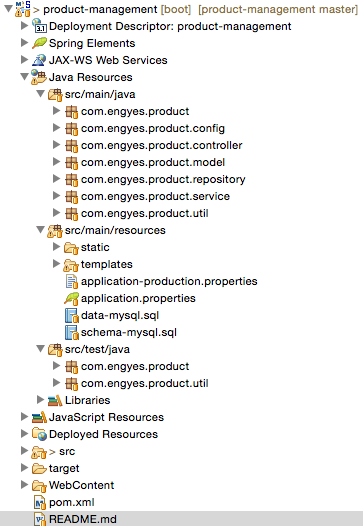

# Product Management

With this project you will have a clean interface to manage your products using power libraries as:

 - Spring Boot
 - Spring Data JPA 
 - Spring Security
 - Thymeleaf
 - Dandelion 
 - Jsoup
 - Mysql 
 - H2 
 - Maven 
 - Junit4
 - Slf4j
 - Bootstrap
 - Jquery

##Functional features:

- Super user to modify data on server side
- Operations allowed
	- Create
	- Update
	- Delete
	- Read
- Listing products with pagination, sort and filter on server side process
- Anonymous user can list all products

## STS Dev Details



Main class 
`com.engyes.product.ProductManagementApplication` defined as

```java
@ComponentScan( "com.engyes.product" )
@Configuration
@EnableAutoConfiguration
public class ProductManagementApplication {

	public static void main( String[] args ) {
		SpringApplication.run( ProductManagementApplication.class, args );
	}
}
```

As you can see the project is clean, it uses the Spring Boot feature to autoconfigure the most of services used, others are customized in others classes.

## Usage

Note, this project was created with Spring Tool suite (STS) and it doesn't mean you can't use others IDEs as (InteliJ, Eclipse....)

Running the project

### Package

	mvn package
      
then check `target` directory for update project archive `product-management-x.x.x-SNAPSHOT.jar`.

### Dev profile

Working in development profile, you will have h2 database with 500 products on your database every time that you execute it.

Command

	mvn spring-boot:run

### Prod profile

First time in production, you will need to import the schema on your mysql database, for that, you only need to start the application with command below.

	SPRING_PROFILES_ACTIVE=production mvn spring-boot:run -Dspring.datasource.initialize=true
	
or

	java -jar -Dspring.profiles.active=production -Dspring.datasource.initialize=true product-management-x.x.x-SNAPSHOT.jar 

For next time, you will have to use the command below to not modify the database

	SPRING_PROFILES_ACTIVE=production mvn spring-boot:run

or

	java -jar -Dspring.profiles.active=production product-management-x.x.x-SNAPSHOT.jar 


### Test

	mvn test
      
It will run the full integrate test on project


### History

- 1.0 Initial version
